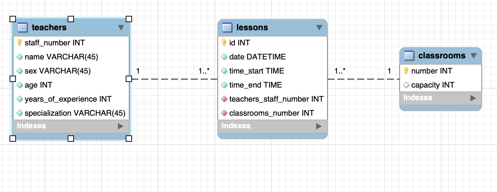
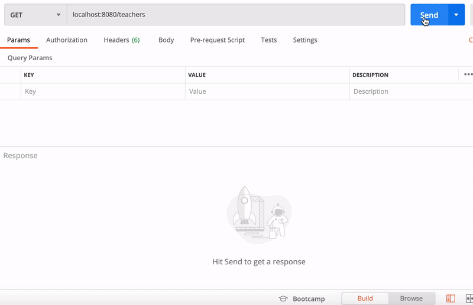
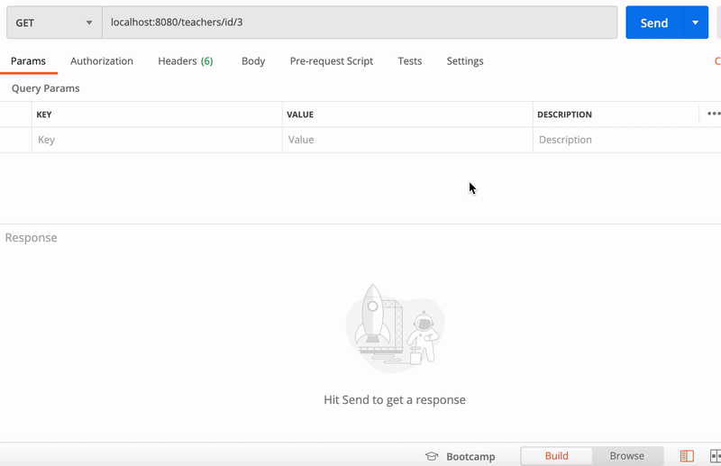
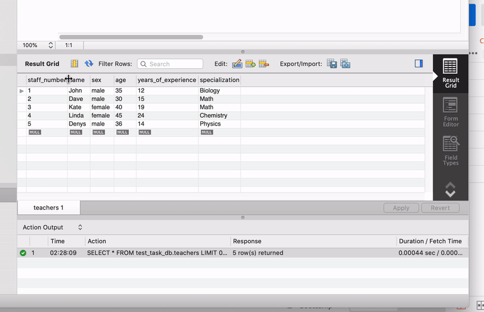
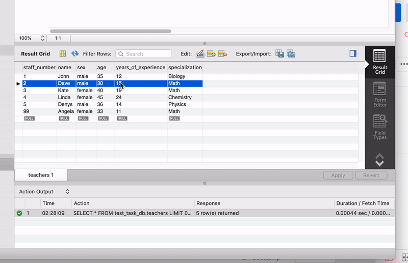
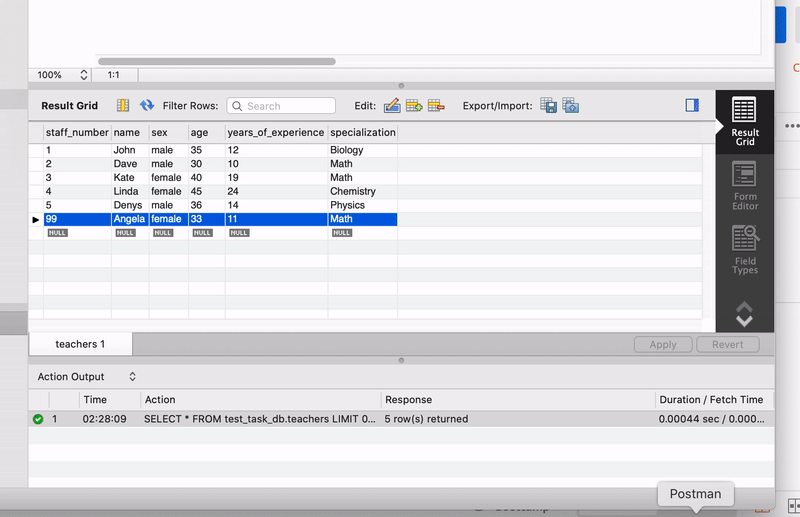

# node-test-project

## MY DB MODEL(MYSQL)

## GET ALL TEACHERS

## GET BY ID

## POST

## UPDATE

## DELETE

## GET TARGET TEACHERS

Implemented using raw SQL and prepared statement.
Please see my db.ts and constants.ts.
